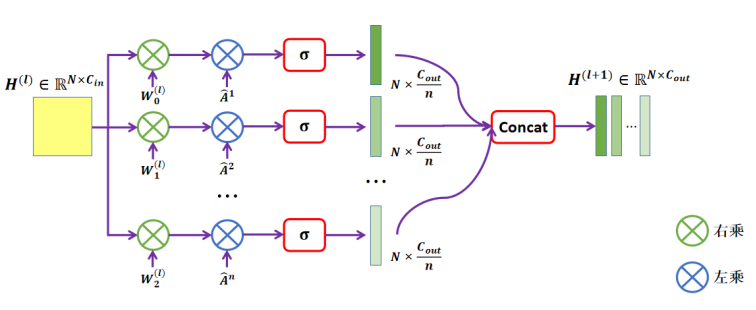
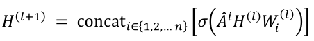
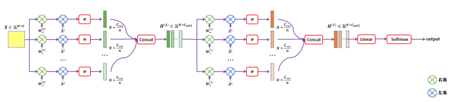
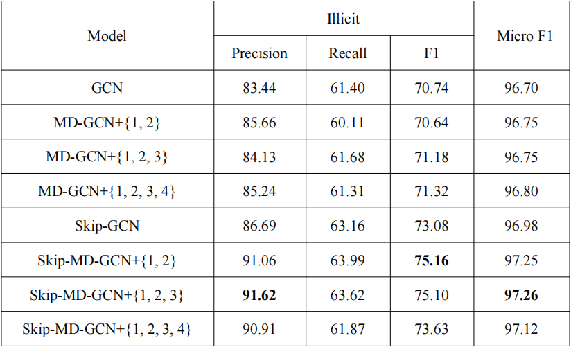

# MD-GCN and GCN

## Introduction
This repo proposes a graph convolution Layer MD-GC-Layer with feature aggregation of multi-distance nodes through graph data modeling of bitcoin transactions,  which takes into account the connection of different transaction nodes in Elliptic Data Set: This graph convolution layer is different from the traditional graph convolution layer, which can aggregate the features of neighboring nodes with different distances from a node and make better use of the connections between different bitcoin transactions. Furthermore, a multi-distance node feature aggregation graph convolutional neural network MD-GCN is designed to meet the abnormal transaction detection of bitcoin system.This repo provides MD-GCN and GCN code.

## Requirements
* Python 3.7.4
* Pytorch 1.2.0
* CUDA 9.2
* Pandas 0.25.3

## Elliptc Data Set Preparation
  Download from https://www.kaggle.com/datasets/ellipticco/elliptic-data-set   
Data loading and preprocessing is in `datalodader.py`

# MD-GCN
## MD-GC-Layer
This repo proposes the MD-GC-Layer to aggregate the multi-distance nodes transactions features to make fully use of the connection of different transactions. The module is listed as follow:  
  
  
  
And the formula is as follow:  


## Multi-Distance Feature Aggregation Graph Convolution Neural Network(MD-GCN)  
  



# Training
Train the GCN model 
```
python train.py --skip False --higherorder False --lr 0.001 --node_embedding 100 --data_root your_data_root_path --end_ts 49 --max_train_ts 34 --seed 8
```
* `--skip` is whether to use skip-gcn or not.
* `--node_embedding` is out channels of the the first GC-Layer.
* `--lr` is the learning rate.
* `--data_root` is the Elliptic Data Set root path.
* `--max_train_ts` is the end time step of train set.

Train the MD-GCN model
```
python train.py --skip False --higherorder True --lr 0.001 --order 2 --node_embedding 100 --out_features 90 --data_root your_data_root_path --end_ts 49 --max_train_ts 34 --seed 8
```
* `--skip` is whether to use skip-gcn or not.
* `--higherorder` is whether to use multi-distance modules or not.
* `--order` is the number of the distance.
* `--node_embedding` is the output channels of the first GC-MD-Layer.
* `--out_features` is the output channels of the second GC-MD-Layer.

# Testing
Test the model and outputs `Precision`, `Recall` and `F1 Score`. 
```
python test.py
```
This repo also choose to draw the Confusion Matrix, Precison-Recall Curve, ROC Curve.
```
python visualize.py
```

# Results on Elliptic Data Set
Several models includes MD-GCN and GCN are tested on Elliptic Data Set, and the results are listed as follow:  
  


